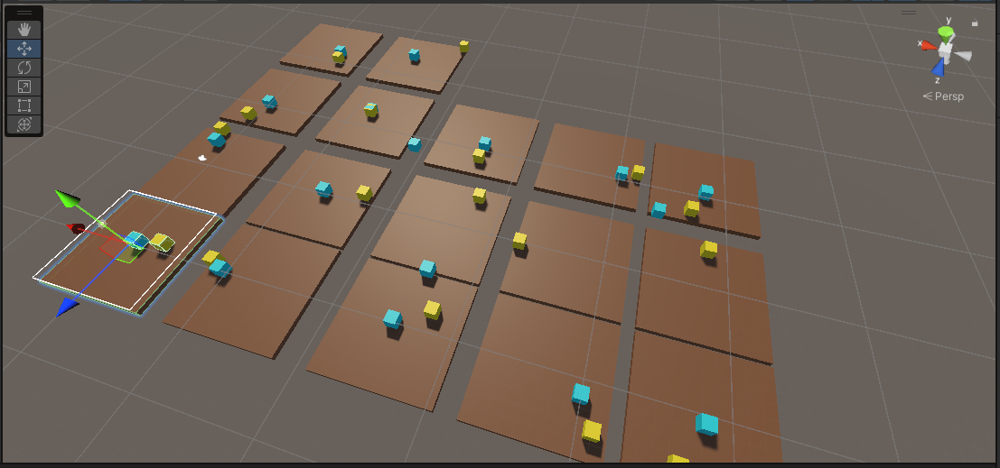

# ml-agents-class

Proyecto ml-agents hecho en clase

El entorno virtual no está subido, si queremos entrenar nosotros la IA: [Pasos para entrenar a la IA](https://github.com/videojuegos-abastos/PRIA/blob/main/te/t5_ml_agents.md#pasos-a-seguir-para-utilizar-ml-agents).

## Entorno

El objetivo de la IA moverse hasta el objetivo (el otro cubo)

  

